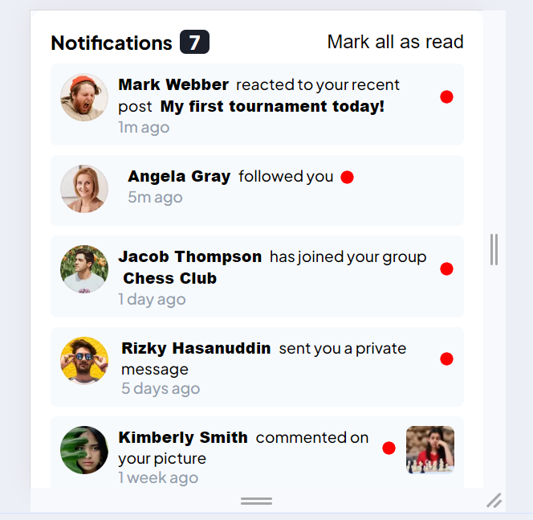

# Frontend Mentor - Notifications page solution

This is a solution to the [Notifications page challenge on Frontend Mentor](https://www.frontendmentor.io/challenges/notifications-page-DqK5QAmKbC). Frontend Mentor challenges help you improve your coding skills by building realistic projects. 

## Table of contents

- [Overview](#overview)
  - [The challenge](#the-challenge)
  - [Screenshot](#screenshot)
  - [Links](#links)
- [My process](#my-process)
  - [Built with](#built-with)
  - [What I learned](#what-i-learned)
  - [Continued development](#continued-development)
- [Author](#author)

## Overview

### The challenge

Users should be able to:

- Distinguish between "unread" and "read" notifications
- Select "Mark all as read" to toggle the visual state of the unread notifications and set the number of unread messages to zero
- View the optimal layout for the interface depending on their device's screen size
- See hover and focus states for all interactive elements on the page

### Screenshot

;
;

### Links

- Solution URL: [Github](https://github.com/SebBudynski/notifications-page)
- Live Site URL: [Netlify](https://notifications-page-sebastian.netlify.app/)

## My process

### Built with

- Semantic HTML5 markup
- CSS custom properties
- Flexbox
- SCSS

### What I learned

In this project i made my first steps in SCSS, learned how to work with Copilot and gained more experience with JavaScript.

### Continued development

In my next project, I want to focus on developing my JavaScript skills, continue witch learning SCSS, and also try to write more semantic code.

## Author

- Website - [Add your name here](https://www.your-site.com)
- Frontend Mentor - [@SebBudynski](https://www.frontendmentor.io/profile/SebBudynski)

